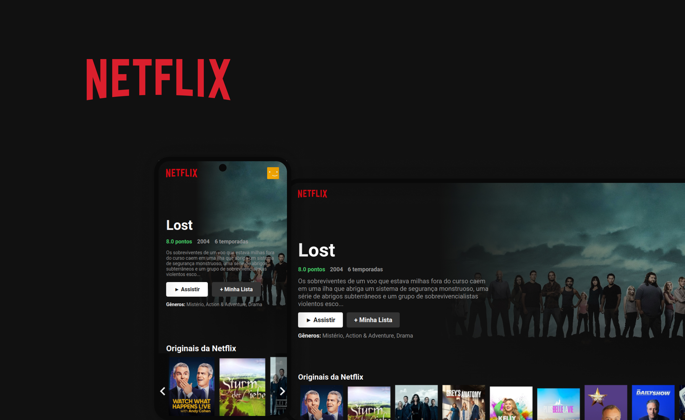

<h1 align="center">Projeto NetFlix | React JS</h1>

<h2 align="center">Sobre</h2>

Esse projeto foi desenvolvido junto com o professor Bonieky Lacerda durante uma live que ele fez no seu canal do <a href="https://www.youtube.com/@bonieky">YouTube.

 

  <a href="#-tecnologias">Tecnologias</a>&nbsp;&nbsp;&nbsp;|&nbsp;&nbsp;&nbsp;
  <a href="#-projeto">Projeto</a>&nbsp;&nbsp;&nbsp;|&nbsp;&nbsp;&nbsp;
  <a href="#memo-licença">Licença</a>

  

 

  

## 🚀 Tecnologias

Esse projeto foi desenvolvido com as seguintes tecnologias:

- React JS
- React Icons
- MUI
- [API TMDB](https://www.themoviedb.org/?language=pt-BR)

## 💻 Projeto

- [Visite o projeto online](https://kelvinymickael.github.io/NETFLIX_CLONE/)

## :memo: Licença

Esse projeto está sob a licença MIT.

---

Developed By Kelviny Mickael.
